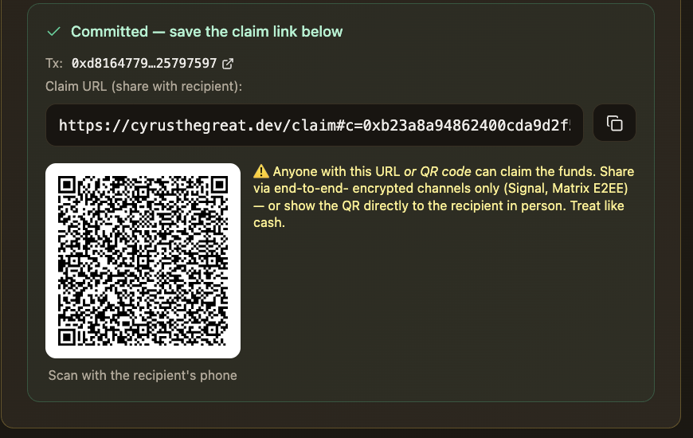

# cyrusthegreat.dev — Self-custodial multi-chain crypto with privacy + yield

**Live Demo**: [cyrusthegreat.dev](https://cyrusthegreat.dev)

Hold and move crypto across 5 chains. Use an optional anonymity pool (CyrusTeleport) to pay anyone without leaving a public link between sender and recipient. Yield-bearing tresor in development. Self-custodial throughout — no single intermediary holds your funds.

## Screenshots

The dapp without connecting a wallet — for reviewers, grant panels, and anyone who wants to evaluate the UI without going through the wallet-connect flow.

| Surface | Preview | What to look at |
|---|---|---|
| **v1 — CyrusTresor (vault home)** |  | "Secure Vault" hero, branding ("human rights since 539BC"), wallet + vault balance cards, connect-wallet CTAs, feature blurbs (Anonymous Transfers / Secure Storage / Multi-Asset Support) |
| **v1 — Multi-token batched deposit** |  | 3-token batch (ETH 0.3 + WLFI 50 + USD1 10), MAX-approval toggles per token, live balance read, validation summary, single "Deposit 3 Tokens" CTA |
| **v2 — CyrusTeleport commit form** |  | Testnet/Mainnet switch, v1/v2 tabs, 5-chain switcher (tETH active), real wallet balance, bucket picker (0.001 / 0.01 / 0.1 / 1 ETH), Teleport/Escrow tabs, fee summary, eligible-epoch ETA |
| **v2 — Commit success + shareable claim URL** |  | Post-commit result card: tx hash + link, full claim URL with copy button, QR code, yellow "treat like cash" warning |
| **/claim page** |  | Recipient-side claim flow: decoded claim details (chain, token, amount, recipient, contract, commitment hash), "Already claimed" success state with link to view contract events on the explorer |

## 🚀 Features

### **Core Functionality**
- **Anonymous ETH Operations**: Deposit, withdraw, and internal transfers
- **Full ERC20 Support**: Dynamic token detection and management
- **Multi-Chain Live**: Ethereum, BSC, Base, Arbitrum, HyperEVM — 5 testnets deployed. Solana + ICP / Bitcoin via Chain Fusion on roadmap.
- **Smart Fee System**: Dynamic $0.10 USD fees via Chainlink price feeds

### **User Experience**
- **Beautiful UI/UX**: Modern, responsive design with shadcn/ui components
- **Multiple Display Modes**: Tabs, Cards, Tabbed-Cards, and Native/Tokens views
- **Real-Time Updates**: Live balance updates and transaction confirmations
- **One-Click Operations**: Uniswap-style approval and deposit flows

### **Security & Privacy**
- **Method ID Privacy**: Obfuscated transaction methods
- **Event Privacy**: Anonymous internal transfers
- **Smart Contract Security**: Audit-ready vault contracts with explicit access controls. Formal third-party audit planned with grant funding — see [docs/AUDIT_RFP.md](docs/AUDIT_RFP.md).

## 🛠️ Technology Stack

- **Frontend**: React 18 + TypeScript + Vite
- **UI Framework**: shadcn/ui + Tailwind CSS
- **Web3 Integration**: Wagmi + Viem + Reown AppKit
- **Blockchain**: Ethereum (Sepolia/Mainnet), BSC, Base
- **Deployment**: Cloudflare Pages

## 🚀 Quick Start

### **Prerequisites**
- Node.js 18+ (20+ recommended)
- npm or yarn
- MetaMask or compatible Web3 wallet

### **Installation**

```bash
# Clone the repository
git clone https://github.com/yourusername/cyrus-the-great.git
cd cyrus-the-great

# Install dependencies
npm install

# Set up environment variables
cp .env.example .env
# Edit .env with your API keys and contract addresses

# Start development server
npm run dev
```

### **Environment Variables**

Create a `.env` file in the root directory:

```bash
# Cyrus The Great Vault Configuration
VITE_CTGVAULT_ADDRESS_ETH=your_eth_contract_address
VITE_CTGVAULT_ADDRESS_BSC=your_bsc_contract_address

# API Keys
VITE_REOWN_PROJECT_ID=your_reown_project_id
VITE_ANKR_API_KEY=your_ankr_api_key
VITE_ALCHEMY_API_KEY=your_alchemy_api_key
VITE_ETHERSCAN_API_KEY=your_etherscan_api_key
VITE_BSCSCAN_API_KEY=your_bscscan_api_key
```

## 📱 Usage

### **Display Modes**
- **Tabs Mode**: Clean tabbed interface for tokens
- **Cards Mode**: Visual card-based token display
- **Tabbed-Cards Mode**: Hybrid approach with internal tabs
- **Native/Tokens Mode**: Separate native currency and token management

### **Keyboard Shortcuts**
- `Ctrl+1`: Switch to Tabs mode
- `Ctrl+2`: Switch to Cards mode
- `Ctrl+3`: Switch to Tabbed-Cards mode
- `Ctrl+4`: Switch to Native/Tokens mode

### **Token Operations**
1. **Deposit**: Approve and deposit tokens to vault
2. **Withdraw**: Remove tokens from vault to wallet
3. **Transfer**: Send tokens anonymously to other vault users

## 🔧 Development

### **Available Scripts**

```bash
npm run dev          # Start development server
npm run build        # Build for production
npm run preview      # Preview production build
npm run lint         # Run ESLint
npm run type-check   # Run TypeScript type checking
```

### **Project Structure**

```
src/
├── components/          # React components
│   ├── modals/         # Modal dialogs
│   ├── ui/             # shadcn/ui components
│   ├── VaultCore.tsx   # Main dashboard
│   └── WalletConnector.tsx
├── hooks/              # Custom React hooks
├── config/             # Configuration files
├── lib/                # Utility libraries
└── pages/              # Page components
```

## 🌐 Deployment

### **Cloudflare Pages (Recommended)**

1. Connect your GitHub repository to Cloudflare Pages
2. Set build command: `npm run build`
3. Set output directory: `dist`
4. Add environment variables
5. Deploy and connect custom domain

### **Manual Deployment**

```bash
# Build the project
npm run build

# Deploy to your preferred hosting service
# The built files are in the `dist` directory
```

## 🔒 Security

- **No API keys** are stored in the repository
- **Environment variables** are properly excluded from git
- **Smart contract interactions** use proper error handling
- **User data** is never stored or transmitted

## 🤝 Contributing

1. Fork the repository
2. Create a feature branch (`git checkout -b feature/amazing-feature`)
3. Commit your changes (`git commit -m 'Add amazing feature'`)
4. Push to the branch (`git push origin feature/amazing-feature`)
5. Open a Pull Request

## 📄 License

This project is licensed under the MIT License - see the [LICENSE](LICENSE) file for details.

## 🙏 Acknowledgments

- **Reown AppKit** for wallet integration
- **shadcn/ui** for beautiful UI components
- **Wagmi** for Web3 React hooks
- **Viem** for low-level Ethereum interactions

## 📞 Support

- **Website**: [cyrusthegreat.dev](https://cyrusthegreat.dev)
- **Twitter**: [@humanperzeus](https://x.com/humanperzeus)
- **GitHub**: [Issues](https://github.com/yourusername/cyrus-the-great/issues)

---

**Made with ❤️ by [@humanperzeus](https://x.com/humanperzeus)**

*Cyrus The Great - Empowering anonymous Web3 transactions*
